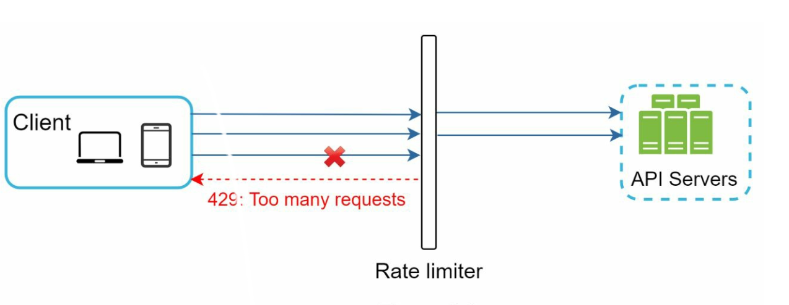
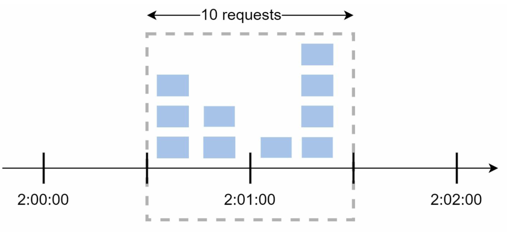

# Chapter 4: Design a Rate Limiter

## Introduction
This chapter explores the design and implementation of a rate limiter—a system component used to control traffic rates sent by clients or services. Rate limiters are crucial for preventing abuse, reducing costs, and ensuring the stability of server resources. Examples of their use include limiting posts, account creations, and reward claims.

## Benefits of Rate Limiting
- **Preventing DoS Attacks:** Blocking excess calls to avoid resource starvation.
- **Cost Reduction:** Limiting unnecessary requests to reduce server expenses.
- **Preventing Overloads:** Filtering out excessive requests to stabilize server performance.

## Step 1: Understanding the Problem
### Key Features
- Server-side API rate limiter.
- Support for multiple throttle rules.
- Handle large-scale systems in distributed environments.
- Option for a standalone service or application-level code.
- Inform users when throttled.

### Requirements
- Accurate request throttling.
- Minimal latency.
- Low memory usage.
- Distributed capability.
- Clear exception handling.
- High fault tolerance.

## Step 2: High-Level Design
### Placement Options

    

1. **Client-Side Implementation:** Unreliable due to potential misuse.
2. **Server-Side Implementation:** Preferred for control and reliability.
3. **Middleware (API Gateway):** A flexible option for integrated rate limiting.

### Guidelines for Placement
- Evaluate current tech stack and choose efficient options.
- Select appropriate algorithms based on business needs.
- Use an API gateway if microservices are employed.
- Opt for commercial solutions if resources are limited.

## Step 3: Rate Limiting Algorithms
### 1. Token Bucket

  

- **Description:** Tokens are added to a bucket at a fixed rate; each request consumes a token.
- **Parameters:** Bucket size and refill rate.
- **Pros:** Easy to implement, memory-efficient, supports traffic bursts.
- **Cons:** Requires careful parameter tuning.

### 2. Leaking Bucket

  

- **Description:** Processes requests at a fixed rate using a FIFO queue.
- **Pros:** Memory-efficient, stable outflow rate.
- **Cons:** Traffic bursts may delay recent requests.
  

  Example: https://github.com/uber-go/ratelimit

### 3. Fixed Window Counter

  

- **Description:** Divides time into fixed intervals and uses counters to limit requests.
- **Pros:** Simple, efficient for specific use cases.
- **Cons:** Traffic spikes at window edges can exceed limits.

- Sudden burst of traffic at the edges of time windows
could cause more requests than allowed quota to go through.

  

### 4. Sliding Window Log

  

- **Description:** Tracks timestamps to allow a rolling time window.
- **Pros:** Accurate rate limiting.
- **Cons:** High memory consumption.
  

### 5. Sliding Window Counter

  

- **Description:** Combines fixed window and sliding log methods for smoothing spikes.
- **Pros:** Memory-efficient, handles traffic bursts.
- **Cons:** Approximation may not be perfectly strict.
  

## High-Level Architecture

  

- **Data Storage:** Use in-memory caching (e.g., Redis) for fast counter operations.
- **Steps:**
  1. Client sends request to middleware.
  2. Middleware checks counters in Redis.
  3. Request is processed or rejected based on limits.

## Advanced Considerations
### Distributed Environments
- **Challenges:** Race conditions, synchronization issues.
- **Solutions:** Use locks, Lua scripts, or sorted sets in Redis. Employ centralized data stores for synchronization.

### Performance Optimizations
- Multi-data center setups for reduced latency.
- Eventual consistency models for synchronization.

### Monitoring
- Regular analytics to ensure algorithm effectiveness and adjust rules as needed.

---

## Beginner Notes
### What a Rate Limiter Actually Does
A rate limiter answers this question for every request:

**Should this request be allowed right now or rejected?**

### Where Limits Can Be Applied
- per user
- per IP
- per API key
- per endpoint
- per tenant

## Advanced Design Questions
- Do limits need to be globally correct across regions?
- Is eventual consistency acceptable?
- What happens if Redis becomes unavailable?
- Do you fail open or fail closed?

### Fail Open vs Fail Closed
- **Fail open**: allow traffic if limiter is broken.
- **Fail closed**: reject traffic if limiter is broken.

## Common Mistakes
- Using fixed windows without acknowledging edge bursts.
- Forgetting clock skew in distributed systems.
- Not defining the rate-limit key correctly.

---

## Interview Questions
1. Which algorithm would you choose for API rate limiting and why?
2. How do you implement rate limiting in Redis safely?
3. How do per-user and per-IP limits interact?
4. What happens when the limiter datastore fails?
5. How do you support different plans with different quotas?

## Chapter Glossary
- **Burst**: a short spike of requests.
- **Quota**: allowed amount of traffic in a period.
- **Throttle**: slow down or reject requests beyond the allowed rate.
- **Fail open**: allow traffic when the limiter is unavailable.
- **Fail closed**: reject traffic when the limiter is unavailable.

---

## Example Walkthrough
### Example: Per-User API Limit
Requirement:
- allow 100 requests per minute per user

Possible implementation:
1. Build a rate-limit key like `user_id + endpoint`.
2. Store request counters in Redis.
3. Use a sliding-window or token-bucket algorithm.
4. If limit is exceeded, return `429 Too Many Requests`.
5. Include retry metadata in headers if needed.

## Exercises
1. Why is token bucket often preferred for bursty traffic?
2. What is the weakness of fixed windows?
3. What should happen if the limiter store becomes unavailable?

---

## One-Minute Revision
- rate limiter decides allow or reject
- choose a key such as user, IP, or API key
- token bucket handles bursts well
- fixed windows are simple but inaccurate at boundaries
- decide fail open or fail closed deliberately

## Exercise Answers
1. Token bucket allows short bursts while still enforcing a long-term average rate.
2. Fixed windows allow edge bursts where a client can send many requests around a boundary and exceed the intended effective rate.
3. It depends on policy: fail open for higher availability or fail closed for stronger protection and cost control.
