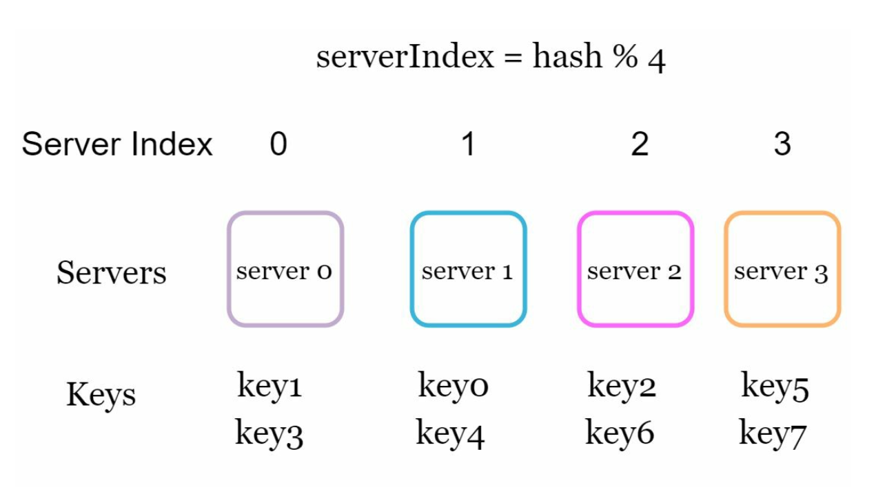
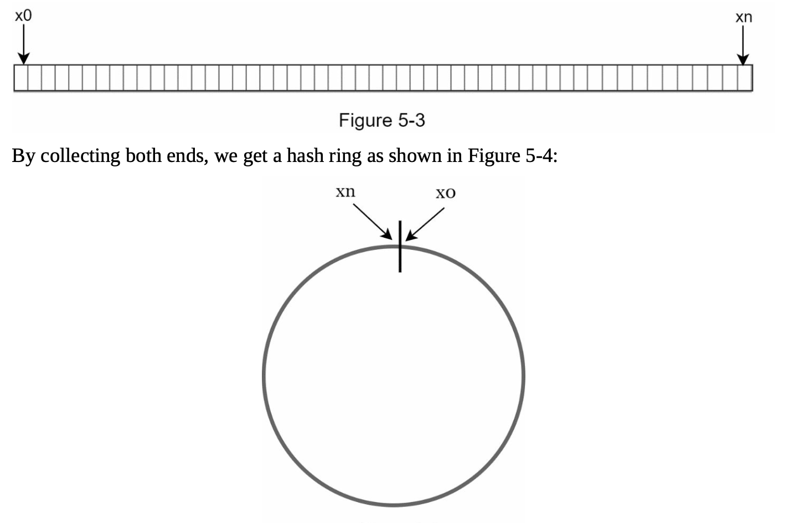
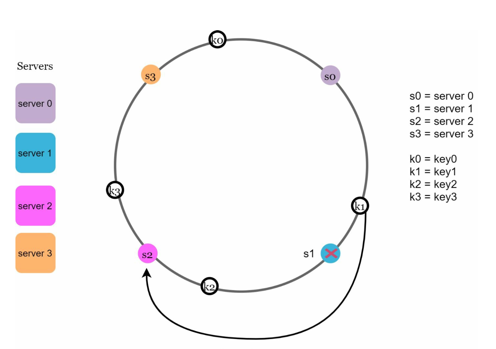
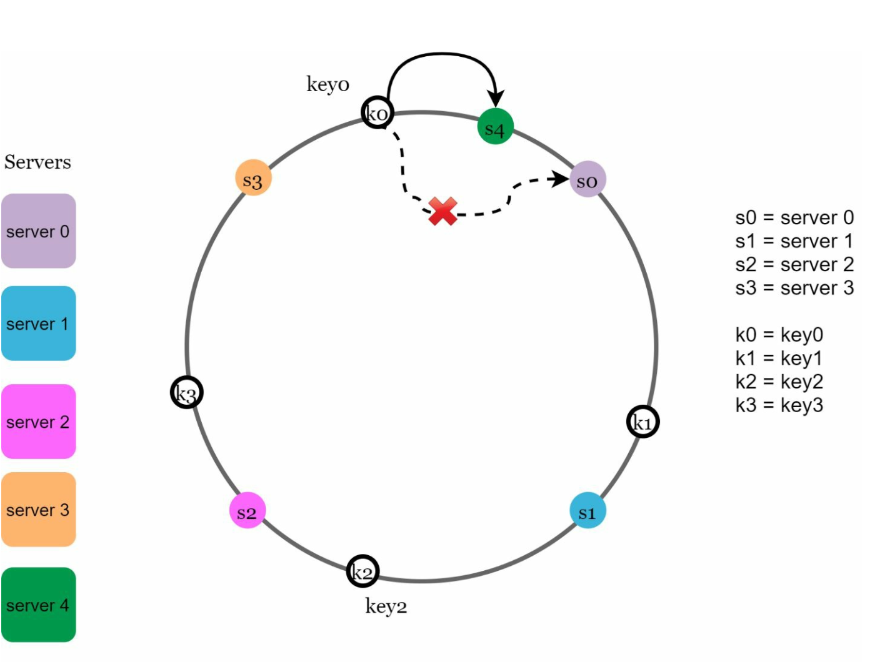
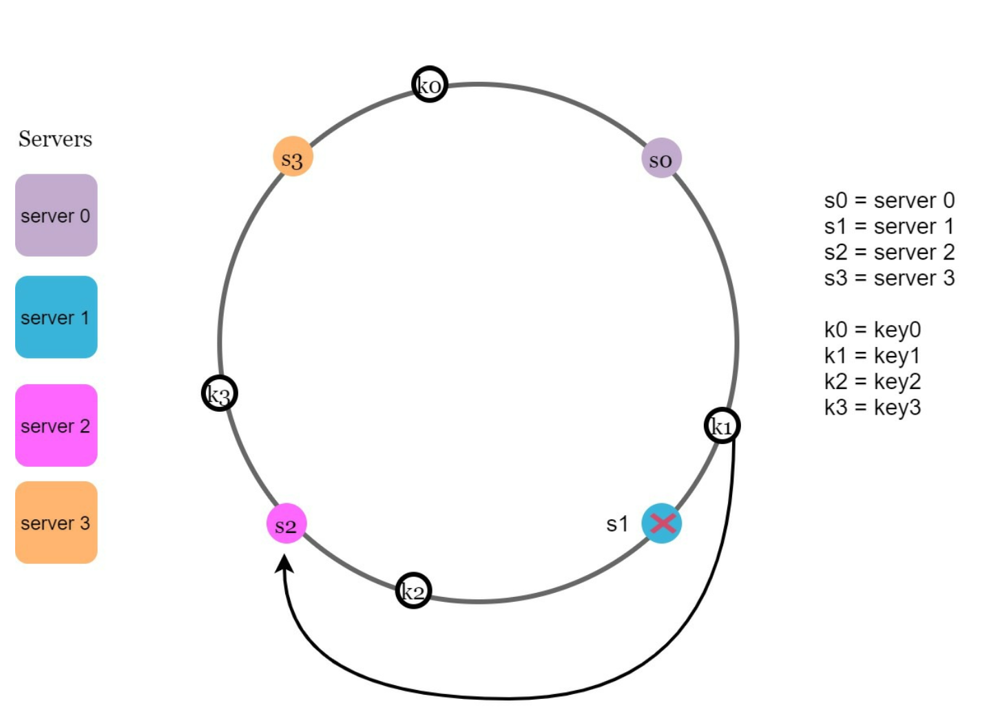

# Chapter 5: Design Consistent Hashing

## Introduction
This chapter explores consistent hashing, a technique essential for achieving horizontal scaling by efficiently distributing requests and data across servers. It minimizes data redistribution when servers are added or removed and ensures an even distribution of data to mitigate issues like server hotspots.

## The Rehashing Problem
### Explanation
In traditional hashing methods, such as `serverIndex = hash(key) % N`, data redistribution becomes problematic when the number of servers changes. For example:
- Removing a server causes most keys to be reassigned, leading to cache misses.
- Adding a server results in unnecessary key redistributions.

  

- This approach works well when the size of the server pool is fixed. However, problems arise when new servers are added, or existing servers are removed.

  

### Key Issue
Redistribution of most keys when server count changes causes inefficiency and overload.

## Consistent Hashing
### Definition
Consistent hashing ensures that only a fraction of keys are remapped when servers are added or removed. This minimizes disruptions and enhances scalability.

### Key Concepts
1. **Hash Space and Ring:** The hash space forms a continuous ring, with hash values distributed from `0` to `2^160-1` (e.g., using hash function like SHA-1). By connecting both ends we get a ring.
    

    
    

- Using the same hash function f, we map servers based on server IP or name onto the ring.  

    

    
    

1. **Server Lookup**
- A key's server is determined by traversing clockwise on the ring until a server is found.

  

  
  

2. **Adding and Removing Servers**
- Adding a server redistributes only nearby keys. Only a fraction of keys are redistributed to the new server.
  
  

  
  

- Removing a server affects only the keys in its range. Only keys from the removed server are reassigned to the next server clockwise.

  

  
  

## Challenges and Solutions
### Two Issues in Basic Approach
1. **Uneven Partition Sizes:** Servers may have unequal data partitions.
2. **Non-uniform Key Distribution:** Some servers may receive significantly more keys than others.

### Solution: Virtual Nodes
- Each server is represented by multiple virtual nodes on the ring uniformly distrubuted on the ring.
- Virtual nodes improve key distribution and balance load. As the number of virtual nodes increases, the distribution of keys       becomes more balanced. This is because the standard deviation gets smaller with more virtual nodes, leading to balanced data distribution.
   
  

  
  

## Affected Keys
When servers are added or removed:
- **Added Server:** Affected keys are those between the new server and its predecessor.
  In the following example server 4 is added onto the ring. The affected range starts from s4 (newly
  added node) and moves anticlockwise around the ring until a server is found (s3). Thus, keys
  located between s3 and s4 need to be redistributed to s4.

  

  
  

- **Removed Server:** Affected keys are those between the removed server and its predecessor. In the following example when a server (s1) is removed, the affected range starts from s1
(removed node) and moves anticlockwise around the ring until a server is found (s0). Thus, keys located between s0 and s1 must be redistributed to s2.
   
  

  
  

## Benefits of Consistent Hashing
- **Minimized Redistribution:** Only a fraction of keys are reassigned.
- **Scalability:** Enables horizontal scaling.
- **Mitigates Hotspots:** Balances data distribution to avoid server overload.

## Real-World Applications
- Amazon Dynamo DB
- Apache Cassandra
- Discord
- Akamai CDN
- Maglev Load Balancer

---

## Beginner Notes
### Why Normal Hashing Fails at Scale
If you map keys by `hash(key) % N`, adding or removing one server changes `N`, so a huge number of keys move.

### Main Goal of Consistent Hashing
Move only a small portion of keys when the server set changes.

### Ring Intuition
Servers and keys are placed on a logical ring. A key belongs to the next server clockwise on the ring.

## Advanced Design Questions
- How many virtual nodes should each server get?
- How do you handle machines with different capacities?
- How do you rebalance while traffic is live?
- Is data copied lazily or eagerly during movement?

## Common Mistakes
- Explaining the ring but ignoring virtual nodes.
- Assuming key distribution is always perfectly even.
- Forgetting replica placement across failure domains.

---

## Interview Questions
1. Why is consistent hashing useful in caches and distributed databases?
2. What problem do virtual nodes solve?
3. How do you handle heterogeneous servers with different capacities?
4. What data movement happens when one server is removed?
5. How is consistent hashing different from simple modulo hashing?

## Chapter Glossary
- **Hash ring**: logical circular space where keys and servers are placed.
- **Virtual node**: multiple logical positions assigned to one physical server.
- **Rebalancing**: moving ownership of keys when topology changes.
- **Hotspot**: uneven concentration of traffic on a small set of keys or nodes.

---

## Example Walkthrough
### Example: Adding One New Cache Server
1. Existing keys are mapped on the hash ring.
2. A new server is added at one or more positions on the ring.
3. Only keys that fall between the new server and its predecessor move.
4. All other keys remain on their original servers.

This is why consistent hashing reduces large-scale remapping.

## Exercises
1. Why does modulo hashing move far more keys than consistent hashing?
2. What problem do virtual nodes solve?
3. Why should replicas live in different failure domains?

---

## One-Minute Revision
- modulo hashing remaps too many keys when `N` changes
- consistent hashing moves only a subset of keys
- virtual nodes smooth distribution
- replicas should not share the same failure domain

## Exercise Answers
1. Modulo hashing depends on the total number of servers, so changing `N` changes the destination for most keys.
2. Virtual nodes reduce uneven distribution and help handle heterogeneous server capacity.
3. Different failure domains reduce the chance that one rack, zone, or data center failure removes all copies together.
