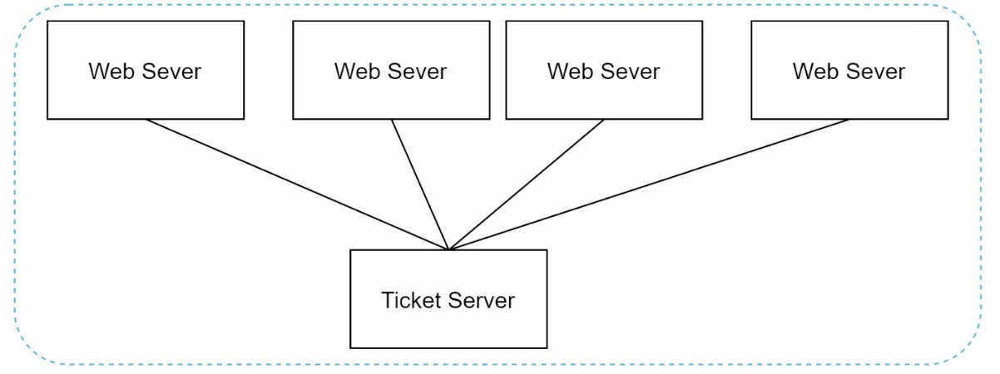

# Chapter 7: Design a Unique ID Generator in Distributed Systems

## Introduction
This chapter addresses the challenge of designing a **unique ID generator** for distributed systems. Traditional auto-increment keys are unsuitable in distributed environments due to scalability and synchronization challenges. The focus is on creating unique, sortable, 64-bit numerical IDs that meet the following requirements:
- IDs must be **unique** and **ordered by date**.
- IDs must fit within **64 bits**.
- The system should generate **over 10,000 IDs per second**.

---

## Step 1: Understanding the Problem
### Basic Requirements
- IDs must be unique and numerical and should fit in 64 bi.
- IDs increment with time but not strictly by `+1`.
- IDs should be sortable by date.
- System must handle high throughput (10,000 IDs/sec).

---

## Step 2: High-Level Design Options
### 1. Multi-Master Replication
- **Approach:** Use database `auto_increment` with step increments (e.g., `+k` for k servers).

    

    
    

- **Drawbacks:**
  - Hard to scale across data centers.
  - IDs do not always increase with time.
  - Scaling issues when servers are added/removed.

### 2. UUID (Universally Unique Identifier)
- **Approach:** 
    - Generate 128-bit unique identifiers independently on each server using UUID.
    - UUIDs can be generated independently without coordination between servers

        

        
        

- **Advantages:**
  - No coordination needed between servers.
  - Scales easily with web servers.
- **Drawbacks:**
  - Exceeds 64-bit requirement.
  - IDs are not sortable by time and may be non-numeric.

### 3. Ticket Server
- **Approach:** Use a centralized database server to increment and assign IDs.

    

    
    

- **Advantages:**
  - Simple to implement for small-scale systems.
  - Generates numeric IDs.
- **Drawbacks:**
  - Single point of failure.
  - Synchronization challenges in multi-server setups.

### 4. Twitter Snowflake Approach
- **Approach:** 

    

      
    

    

      
    

    - Divide IDs into sections to ensure uniqueness and scalability.
    - **Sign Bit (1 bit):** Always `0`, potentially distinguishing signed and unsigned numbers.
    - **Timestamp (41 bits):** Milliseconds since a custom epoch (Twitter's default is `1288834974657`, equivalent to Nov 04, 2010, 01:42:54 UTC). Ensures IDs are time-ordered.
    - **Datacenter ID (5 bits):** Identifies up to `2^5 = 32` datacenters.
    - **Machine ID (5 bits):** Identifies up to `2^5 = 32` machines within each datacenter.
    - **Sequence Number (12 bits):** Tracks IDs generated on a machine within the same millisecond, supporting up to `2^12 = 4096` IDs per millisecond. The sequence resets to `0` every millisecond.

- **Advantages:**
    - **Scalability:** Handles 10,000+ IDs per second across multiple servers.
    - **Time-Order:** Ensures IDs are sortable by time.
    - **Decentralization:** No single point of failure.

## Step 4: Additional Considerations
### 1. Clock Synchronization
- **Challenge:** ID generation assumes synchronized clocks across servers.
- **Solution:** Use **Network Time Protocol (NTP)** to minimize drift.

### 2. Section Length Tuning
- Adjust section sizes (e.g., fewer sequence bits, more timestamp bits) based on use case.

### 3. High Availability
- ID generators are mission-critical and must be fault-tolerant.
- Consider redundancy and failover mechanisms.

---

## Beginner Notes
### Why ID Generation Is a System Design Problem
An ID must often be:
- unique
- fast to generate
- sortable or roughly time-ordered
- available across many servers

### Desirable ID Properties
- uniqueness
- scalability
- low latency
- small size
- lexical or numeric sortability

## Advanced Design Questions
- Must IDs be globally ordered or just unique?
- Can gaps exist?
- Is predictability a security issue?
- What happens if clocks move backward?

## Common Mistakes
- Confusing uniqueness with ordering.
- Ignoring clock rollback in Snowflake-style designs.
- Using UUID blindly when storage locality matters.

---

## Interview Questions
1. Why can auto-increment IDs be problematic in distributed systems?
2. When is UUID good enough, and when is it a poor choice?
3. What are the main pieces of a Snowflake-like ID?
4. How do you handle machine ID assignment safely?
5. What should the system do if the clock moves backward?

## Chapter Glossary
- **UUID**: a large unique identifier usually generated without coordination.
- **Ticket server**: central service handing out ID ranges or sequential IDs.
- **Snowflake**: time-based distributed ID scheme with embedded machine bits.
- **Clock drift**: difference between server clocks over time.

---

## Example Walkthrough
### Example: Snowflake-Style ID Generation
1. Take the current timestamp in milliseconds.
2. Add a machine or worker identifier.
3. Add a sequence number for IDs generated within the same millisecond.
4. Combine the fields into one 64-bit integer.

This gives uniqueness with rough time ordering if clocks behave correctly.

## Exercises
1. Why is global ordering harder than uniqueness?
2. What breaks if two machines accidentally share the same worker ID?
3. What should happen if the sequence overflows within one millisecond?

---

## One-Minute Revision
- uniqueness is easier than ordering
- UUID is easy but large and not time-friendly
- ticket servers are simple but centralized
- Snowflake balances uniqueness, speed, and rough ordering
- clock behavior matters

## Exercise Answers
1. Uniqueness only requires avoiding collisions, but global ordering requires coordination across many machines and times.
2. They may generate identical IDs for the same timestamp and sequence range, causing collisions.
3. The generator must wait for the next millisecond or use another safe overflow strategy.
