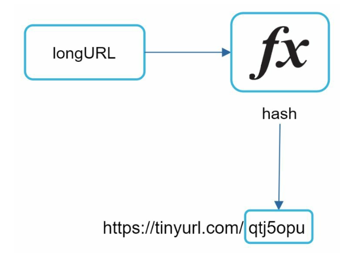
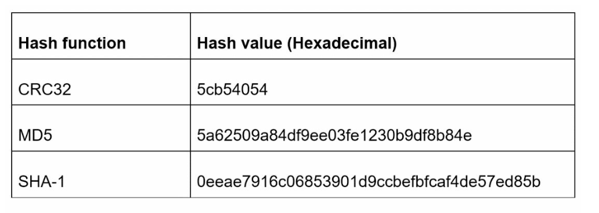
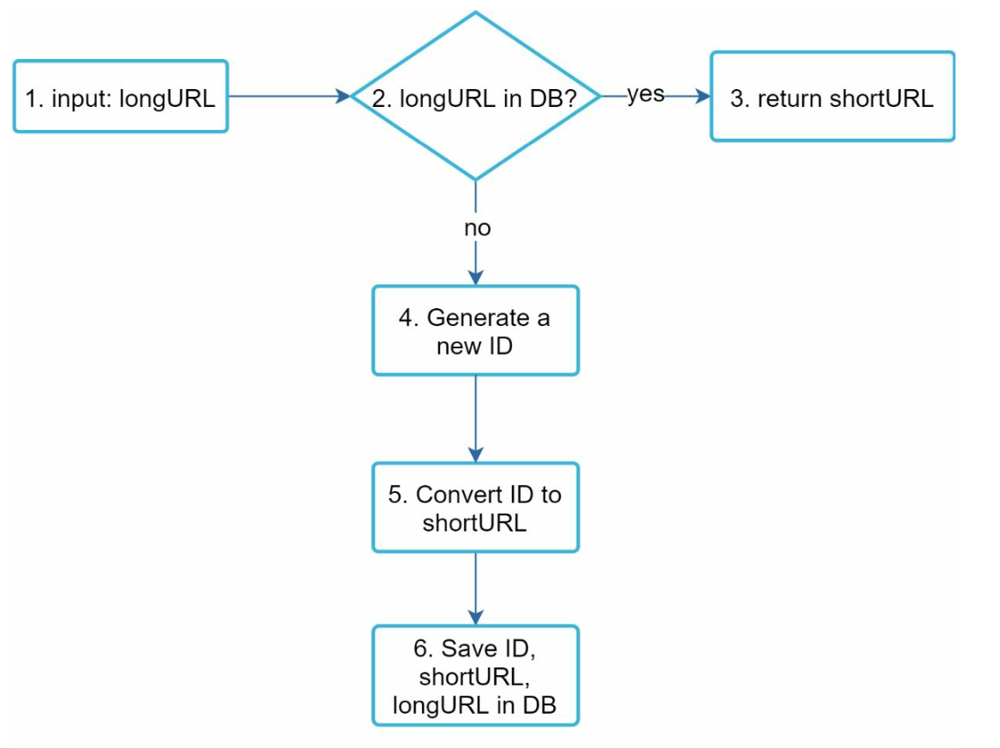

# Chapter 8: Design a URL Shortener

## Introduction
This chapter discusses the design of a URL shortening service like TinyURL. The system's main goals include **URL shortening**, **redirecting**, and **high scalability** to handle large traffic volumes.

### Requirements
- Shortened URLs must be **unique** and as **short as possible**.
- Handle **100 million URL generations per day** with a 10-year support capacity.
- Support **efficient read operations** with a 10:1 read-to-write ratio.
- Store 365 billion records, requiring approximately **365 TB** of storage over 10 years.

---

## Step 1: High-Level Design

### API Endpoints
1. **URL Shortening:**  
   - Endpoint: `POST api/v1/data/shorten`  
   - Parameters: `{longUrl: longURLString}`  
   - Returns: `shortURL`

2. **URL Redirecting:**  
   - Endpoint: `GET api/v1/shortUrl`  
   - Returns: `longURL` for redirection.

    

    
    

### URL Redirection
- **301 Redirect:**  A 301 redirect shows that the requested URL is “permanently” moved to the long URL. The browser caches the response, and
subsequent requests for the same URL will not be sent to the URL shortening service.
- **302 Redirect:** Temporary; useful for analytics like tracking clicks.

### URL Shortening

    

- Use a **hash function** to generate a short URL, mapping long URLs to unique shortened versions.
- The hash function must satisfy the following requirements:
    - Each longURL must be hashed to one hashValue.
    - Each hashValue can be mapped back to the longURL.
    

---

## Step 2: Deep Dive into Design

### Data Model
Store `<shortURL, longURL>` mappings in a relational database to optimize memory usage. The table schema includes:
- `id` (primary key),
- `shortURL`,
- `longURL`.

    

### Hash Function
#### 1. Base 62 Conversion:
- Encodes numbers using characters `[0-9, a-z, A-Z]`, providing **62 possible characters**.
- Base conversion is another approach commonly used for URL shorteners. 
- A unique id can be assigned to the short url and ID can be base 62 converted to get the short URL.
- A 7-character hash supports up to **3.5 trillion unique URLs**, enough for 365 billion URLs.

**Example:**  
Convert ID `2009215674938` to Base 62:
- `2009215674938` → `zn9edcu`.

#### 2. Hash + Collision Resolution:
- Use hash functions like CRC32, MD5, or SHA-1.

    

- One approach is to collect the first 7 characters of a hash value; however, this method can lead to hash collisions.
- To resolve collisions,recursively append a new predefined string until no more collision but this can be expensive.
- Resolve collisions with **Bloom Filters** for efficient lookup.

    

    
    

### Comparison

-  **Hash + Collision Resolution:**
    - Fixed short URL length
    - Does not need a unique ID generator
    - Collision is possbile and needs resolution
    - Not possible to find the next available short URL because it does not depend on ID

- **Base 62 Conversion**
    - The length is not fixed and goes up with ID
    - It needs a unique ID generator
    - Collision is not possbile
    - Easy to find the next short URL if ID increments by 1 (Can be a security concern)

---

### URL Shortening Flow

    

1. Check if `longURL` exists in the database.
2. If found, return the existing `shortURL`.
3. Otherwise:
   - Generate a unique ID using a **distributed ID generator**.
   - Convert the ID to `shortURL` using Base 62.
   - Store the `<id, shortURL, longURL>` mapping in the database.

---

### URL Redirecting Flow

    

1. User clicks a `shortURL`.
2. Query `<shortURL, longURL>` mapping:
   - Check the **cache** first for faster access.
   - If not in the cache, query the database.
3. Redirect the user to `longURL`.

---

## Additional Considerations
### Rate Limiter
- Prevent abuse by setting limits on requests per IP.

### Scalability
1. **Web Tier:** Stateless, scalable by adding/removing web servers.
2. **Database Tier:** Use replication and sharding.

### Analytics
- Collect data like click rates, source, and timestamps for business insights.

### High Availability and Reliability
- Ensure consistent and reliable services using database replication and fault-tolerant design.

---

## Beginner Notes
### Core Idea
A URL shortener stores a mapping like:
- short code -> long URL

When a user opens the short URL, the service looks up the original URL and redirects the browser.

### Redirect Types
- `301` permanent redirect
- `302` temporary redirect

## Advanced Design Questions
- How do you avoid collisions in short code generation?
- How do you prevent malicious URLs and spam?
- Should redirects be heavily cached at edge or CDN?
- What happens when one link becomes extremely hot?

## Common Mistakes
- Ignoring the difference between write traffic and much larger redirect traffic.
- Using a random hash without collision strategy.
- Forgetting analytics, abuse control, and spam prevention.

---

## Interview Questions
1. Would you choose random IDs or base62-encoded counters for short URLs?
2. How do you detect and handle collisions?
3. Why might `302` be safer than `301` for some products?
4. How do you make redirects low-latency globally?
5. How do you prevent the service from becoming a phishing tool?

## Chapter Glossary
- **Base62**: encoding using digits plus upper and lower case letters.
- **Collision**: two long URLs or generated IDs producing the same short code.
- **Redirect**: HTTP response telling the browser to load another URL.
- **Alias**: custom user-chosen short code.

---

## Example Walkthrough
### Example: Redirecting a Short URL
1. User opens `short.ly/abc123`.
2. The browser sends an HTTP request to the shortener service.
3. The service checks cache for `abc123`.
4. If not cached, it loads the long URL from the database.
5. The service returns an HTTP redirect response with the original URL.

## Exercises
1. Why can redirect traffic be much larger than create-short-url traffic?
2. When is a custom alias harder to support than generated aliases?
3. Why might caching popular short codes at the edge help a lot?

---

## One-Minute Revision
- store short code to long URL mapping
- redirect path is read-heavy
- collision handling matters
- abuse prevention matters
- hot links benefit heavily from caching

## Exercise Answers
1. One short link can be clicked millions of times while being created only once.
2. Custom aliases require uniqueness checks, reserved-word rules, moderation, and better abuse protection.
3. Popular links get repeated reads, so edge caching reduces latency and origin load dramatically.
